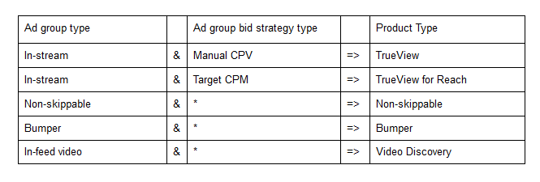

## Googe Ads Analysis
For the first step of this exercise we need to import the pandas, numpy and datetime libraries for that we use the code below:


```python
import pandas as pd
import numpy as np
import datetime as dt
```

The dataset is stored in Dropbox. We import it using the following code:


```python
Google_Ads_df = pd.read_csv('https://www.dropbox.com/s/3uz9skvo96lxtpg/Google_Ads_Dataset.csv?dl=1')
```

In the previouse cell we named our dataframe 'Google_Ads_df'. We use the .head() method to preview the dataframe:


```python
Google_Ads_df.head()
```

<table border="1" class="dataframe">
  <thead>
    <tr style="text-align: right;">
      <th></th>
      <th>Day</th>
      <th>Campaign</th>
      <th>Ad_group</th>
      <th>Ad_group_type</th>
      <th>Ad_group_bid_strategy_type</th>
      <th>Cost</th>
      <th>Views</th>
      <th>Impressions</th>
      <th>Clicks</th>
    </tr>
  </thead>
  <tbody>
    <tr>
      <th>0</th>
      <td>5/31/2022</td>
      <td>Alvin test on EOS video</td>
      <td>Targeting used for nordic test 20190130</td>
      <td>In-stream</td>
      <td>Manual CPV</td>
      <td>4.76</td>
      <td>71</td>
      <td>207</td>
      <td>1</td>
    </tr>
    <tr>
      <th>1</th>
      <td>6/7/2022</td>
      <td>Alvin test on EOS video</td>
      <td>Targeting used for nordic test 20190130</td>
      <td>In-stream</td>
      <td>Manual CPV</td>
      <td>6.40</td>
      <td>45</td>
      <td>225</td>
      <td>1</td>
    </tr>
    <tr>
      <th>2</th>
      <td>6/20/2022</td>
      <td>Alvin test on EOS video</td>
      <td>Targeting used for nordic test 20190130</td>
      <td>In-stream</td>
      <td>Manual CPV</td>
      <td>5.21</td>
      <td>78</td>
      <td>299</td>
      <td>1</td>
    </tr>
    <tr>
      <th>3</th>
      <td>6/29/2022</td>
      <td>Alvin test on EOS video</td>
      <td>Targeting used for nordic test 20190130</td>
      <td>In-stream</td>
      <td>Manual CPV</td>
      <td>4.74</td>
      <td>90</td>
      <td>283</td>
      <td>0</td>
    </tr>
    <tr>
      <th>4</th>
      <td>6/13/2022</td>
      <td>Alvin test on EOS video</td>
      <td>Targeting used for nordic test 20190130</td>
      <td>In-stream</td>
      <td>Manual CPV</td>
      <td>5.22</td>
      <td>72</td>
      <td>249</td>
      <td>1</td>
    </tr>
  </tbody>
</table>
</div>


We will then check on the data types to see if we need to make any changes:


```python
Google_Ads_df.dtypes
```


    Day                            object
    Campaign                       object
    Ad_group                       object
    Ad_group_type                  object
    Ad_group_bid_strategy_type     object
    Cost                          float64
    Views                           int64
    Impressions                     int64
    Clicks                          int64
    dtype: object


We can see that the Day column is an 'object' data type. We need to change this to a date time format:


```python
Google_Ads_df['Day'] = pd.to_datetime(Google_Ads_df['Day'],format = "%m/%d/%Y")
```

We then run the .dtypes method again to verify that the column is the correct data type.


```python
Google_Ads_df.dtypes
```


    Day                           datetime64[ns]
    Campaign                              object
    Ad_group                              object
    Ad_group_type                         object
    Ad_group_bid_strategy_type            object
    Cost                                 float64
    Views                                  int64
    Impressions                            int64
    Clicks                                 int64
    dtype: object


We will then create a new column for the  'Google_Ads_df dataframe called product_Type. This column will follow the logic below:





We do that with the following code:


```python
def product_type_function(col):
   
    if (col['Ad_group_type'] == "In-stream" and col['Ad_group_bid_strategy_type'] == "Manual CPV"):
        return "TrueView"
    elif( col['Ad_group_type'] == "In-stream" and col['Ad_group_bid_strategy_type'] == "Target CPM"):
        return "TrueView for Reach"
    elif( col['Ad_group_type'] == "Non-skippable"):
        return "Non-skippable"
    elif( col['Ad_group_type'] == "Bumper"):
        return "Bumper"
    else:
        return "In-feed video"
Google_Ads_df['product_type'] = Google_Ads_df.apply (lambda col: product_type_function (col), axis=1)
```

We will then preview the first 50 items to see if the code above is workign correctly:


```python
Google_Ads_df.head(n=50)
```

<table border="1" class="dataframe">
  <thead>
    <tr style="text-align: right;">
      <th></th>
      <th>Day</th>
      <th>Campaign</th>
      <th>Ad_group</th>
      <th>Ad_group_type</th>
      <th>Ad_group_bid_strategy_type</th>
      <th>Cost</th>
      <th>Views</th>
      <th>Impressions</th>
      <th>Clicks</th>
      <th>product_type</th>
    </tr>
  </thead>
  <tbody>
    <tr>
      <th>0</th>
      <td>2022-05-31</td>
      <td>Alvin test on EOS video</td>
      <td>Targeting used for nordic test 20190130</td>
      <td>In-stream</td>
      <td>Manual CPV</td>
      <td>4.76</td>
      <td>71</td>
      <td>207</td>
      <td>1</td>
      <td>TrueView</td>
    </tr>
    <tr>
      <th>1</th>
      <td>2022-06-07</td>
      <td>Alvin test on EOS video</td>
      <td>Targeting used for nordic test 20190130</td>
      <td>In-stream</td>
      <td>Manual CPV</td>
      <td>6.40</td>
      <td>45</td>
      <td>225</td>
      <td>1</td>
      <td>TrueView</td>
    </tr>
    <tr>
      <th>2</th>
      <td>2022-06-20</td>
      <td>Alvin test on EOS video</td>
      <td>Targeting used for nordic test 20190130</td>
      <td>In-stream</td>
      <td>Manual CPV</td>
      <td>5.21</td>
      <td>78</td>
      <td>299</td>
      <td>1</td>
      <td>TrueView</td>
    </tr>
    <tr>
      <th>3</th>
      <td>2022-06-29</td>
      <td>Alvin test on EOS video</td>
      <td>Targeting used for nordic test 20190130</td>
      <td>In-stream</td>
      <td>Manual CPV</td>
      <td>4.74</td>
      <td>90</td>
      <td>283</td>
      <td>0</td>
      <td>TrueView</td>
    </tr>
    <tr>
      <th>4</th>
      <td>2022-06-13</td>
      <td>Alvin test on EOS video</td>
      <td>Targeting used for nordic test 20190130</td>
      <td>In-stream</td>
      <td>Manual CPV</td>
      <td>5.22</td>
      <td>72</td>
      <td>249</td>
      <td>1</td>
      <td>TrueView</td>
    </tr>
    <tr>
      <th>5</th>
      <td>2022-06-14</td>
      <td>Alvin test on EOS video</td>
      <td>Targeting used for nordic test 20190130</td>
      <td>In-stream</td>
      <td>Manual CPV</td>
      <td>5.10</td>
      <td>57</td>
      <td>216</td>
      <td>1</td>
      <td>TrueView</td>
    </tr>
    <tr>
      <th>6</th>
      <td>2022-06-18</td>
      <td>Alvin test on EOS video</td>
      <td>Targeting used for nordic test 20190130</td>
      <td>In-stream</td>
      <td>Manual CPV</td>
      <td>4.94</td>
      <td>42</td>
      <td>120</td>
      <td>0</td>
      <td>TrueView</td>
    </tr>
    <tr>
      <th>7</th>
      <td>2022-06-27</td>
      <td>Alvin test on EOS video</td>
      <td>Targeting used for nordic test 20190130</td>
      <td>In-stream</td>
      <td>Manual CPV</td>
      <td>4.79</td>
      <td>88</td>
      <td>310</td>
      <td>0</td>
      <td>TrueView</td>
    </tr>
    <tr>
      <th>8</th>
      <td>2022-06-12</td>
      <td>Alvin test on EOS video</td>
      <td>Targeting used for nordic test 20190130</td>
      <td>In-stream</td>
      <td>Manual CPV</td>
      <td>4.96</td>
      <td>72</td>
      <td>258</td>
      <td>1</td>
      <td>TrueView</td>
    </tr>
    <tr>
      <th>9</th>
      <td>2022-06-03</td>
      <td>Alvin test on EOS video</td>
      <td>Targeting used for nordic test 20190130</td>
      <td>In-stream</td>
      <td>Manual CPV</td>
      <td>5.07</td>
      <td>75</td>
      <td>227</td>
      <td>0</td>
      <td>TrueView</td>
    </tr>
    <tr>
      <th>10</th>
      <td>2022-06-02</td>
      <td>Alvin test on EOS video</td>
      <td>Targeting used for nordic test 20190130</td>
      <td>In-stream</td>
      <td>Manual CPV</td>
      <td>5.01</td>
      <td>96</td>
      <td>283</td>
      <td>0</td>
      <td>TrueView</td>
    </tr>
    <tr>
      <th>11</th>
      <td>2022-06-21</td>
      <td>Alvin test on EOS video</td>
      <td>Targeting used for nordic test 20190130</td>
      <td>In-stream</td>
      <td>Manual CPV</td>
      <td>5.08</td>
      <td>110</td>
      <td>284</td>
      <td>0</td>
      <td>TrueView</td>
    </tr>
    <tr>
      <th>12</th>
      <td>2022-06-15</td>
      <td>Alvin test on EOS video</td>
      <td>Targeting used for nordic test 20190130</td>
      <td>In-stream</td>
      <td>Manual CPV</td>
      <td>5.10</td>
      <td>68</td>
      <td>320</td>
      <td>1</td>
      <td>TrueView</td>
    </tr>
    <tr>
      <th>13</th>
      <td>2022-06-25</td>
      <td>Alvin test on EOS video</td>
      <td>Targeting used for nordic test 20190130</td>
      <td>In-stream</td>
      <td>Manual CPV</td>
      <td>4.89</td>
      <td>72</td>
      <td>247</td>
      <td>0</td>
      <td>TrueView</td>
    </tr>
    <tr>
      <th>14</th>
      <td>2022-06-24</td>
      <td>Alvin test on EOS video</td>
      <td>Targeting used for nordic test 20190130</td>
      <td>In-stream</td>
      <td>Manual CPV</td>
      <td>5.05</td>
      <td>70</td>
      <td>229</td>
      <td>1</td>
      <td>TrueView</td>
    </tr>
    <tr>
      <th>15</th>
      <td>2022-06-05</td>
      <td>Alvin test on EOS video</td>
      <td>Targeting used for nordic test 20190130</td>
      <td>In-stream</td>
      <td>Manual CPV</td>
      <td>5.18</td>
      <td>90</td>
      <td>231</td>
      <td>1</td>
      <td>TrueView</td>
    </tr>
    <tr>
      <th>16</th>
      <td>2022-06-19</td>
      <td>Alvin test on EOS video</td>
      <td>Targeting used for nordic test 20190130</td>
      <td>In-stream</td>
      <td>Manual CPV</td>
      <td>5.00</td>
      <td>51</td>
      <td>236</td>
      <td>0</td>
      <td>TrueView</td>
    </tr>
    <tr>
      <th>17</th>
      <td>2022-06-28</td>
      <td>Alvin test on EOS video</td>
      <td>Targeting used for nordic test 20190130</td>
      <td>In-stream</td>
      <td>Manual CPV</td>
      <td>5.13</td>
      <td>43</td>
      <td>100</td>
      <td>0</td>
      <td>TrueView</td>
    </tr>
    <tr>
      <th>18</th>
      <td>2022-06-30</td>
      <td>Alvin test on EOS video</td>
      <td>Targeting used for nordic test 20190130</td>
      <td>In-stream</td>
      <td>Manual CPV</td>
      <td>4.66</td>
      <td>103</td>
      <td>298</td>
      <td>1</td>
      <td>TrueView</td>
    </tr>
    <tr>
      <th>19</th>
      <td>2022-06-26</td>
      <td>Alvin test on EOS video</td>
      <td>Targeting used for nordic test 20190130</td>
      <td>In-stream</td>
      <td>Manual CPV</td>
      <td>4.85</td>
      <td>46</td>
      <td>204</td>
      <td>0</td>
      <td>TrueView</td>
    </tr>
    <tr>
      <th>20</th>
      <td>2022-06-10</td>
      <td>Alvin test on EOS video</td>
      <td>Targeting used for nordic test 20190130</td>
      <td>In-stream</td>
      <td>Manual CPV</td>
      <td>5.06</td>
      <td>53</td>
      <td>215</td>
      <td>0</td>
      <td>TrueView</td>
    </tr>
    <tr>
      <th>21</th>
      <td>2022-06-17</td>
      <td>Alvin test on EOS video</td>
      <td>Targeting used for nordic test 20190130</td>
      <td>In-stream</td>
      <td>Manual CPV</td>
      <td>4.97</td>
      <td>55</td>
      <td>234</td>
      <td>0</td>
      <td>TrueView</td>
    </tr>
    <tr>
      <th>22</th>
      <td>2022-05-30</td>
      <td>Alvin test on EOS video</td>
      <td>Targeting used for nordic test 20190130</td>
      <td>In-stream</td>
      <td>Manual CPV</td>
      <td>5.04</td>
      <td>72</td>
      <td>211</td>
      <td>1</td>
      <td>TrueView</td>
    </tr>
    <tr>
      <th>23</th>
      <td>2022-05-27</td>
      <td>Alvin test on EOS video</td>
      <td>Targeting used for nordic test 20190130</td>
      <td>In-stream</td>
      <td>Manual CPV</td>
      <td>5.06</td>
      <td>31</td>
      <td>187</td>
      <td>1</td>
      <td>TrueView</td>
    </tr>
    <tr>
      <th>24</th>
      <td>2022-06-16</td>
      <td>Alvin test on EOS video</td>
      <td>Targeting used for nordic test 20190130</td>
      <td>In-stream</td>
      <td>Manual CPV</td>
      <td>5.03</td>
      <td>62</td>
      <td>271</td>
      <td>1</td>
      <td>TrueView</td>
    </tr>
    <tr>
      <th>25</th>
      <td>2022-06-06</td>
      <td>Alvin test on EOS video</td>
      <td>Targeting used for nordic test 20190130</td>
      <td>In-stream</td>
      <td>Manual CPV</td>
      <td>5.31</td>
      <td>70</td>
      <td>272</td>
      <td>0</td>
      <td>TrueView</td>
    </tr>
    <tr>
      <th>26</th>
      <td>2022-06-11</td>
      <td>Alvin test on EOS video</td>
      <td>Targeting used for nordic test 20190130</td>
      <td>In-stream</td>
      <td>Manual CPV</td>
      <td>4.84</td>
      <td>72</td>
      <td>305</td>
      <td>2</td>
      <td>TrueView</td>
    </tr>
    <tr>
      <th>27</th>
      <td>2022-06-22</td>
      <td>Alvin test on EOS video</td>
      <td>Targeting used for nordic test 20190130</td>
      <td>In-stream</td>
      <td>Manual CPV</td>
      <td>4.91</td>
      <td>70</td>
      <td>258</td>
      <td>0</td>
      <td>TrueView</td>
    </tr>
    <tr>
      <th>28</th>
      <td>2022-06-09</td>
      <td>Alvin test on EOS video</td>
      <td>Targeting used for nordic test 20190130</td>
      <td>In-stream</td>
      <td>Manual CPV</td>
      <td>5.17</td>
      <td>58</td>
      <td>218</td>
      <td>0</td>
      <td>TrueView</td>
    </tr>
    <tr>
      <th>29</th>
      <td>2022-06-23</td>
      <td>Alvin test on EOS video</td>
      <td>Targeting used for nordic test 20190130</td>
      <td>In-stream</td>
      <td>Manual CPV</td>
      <td>4.93</td>
      <td>69</td>
      <td>223</td>
      <td>2</td>
      <td>TrueView</td>
    </tr>
    <tr>
      <th>30</th>
      <td>2022-06-08</td>
      <td>Alvin test on EOS video</td>
      <td>Targeting used for nordic test 20190130</td>
      <td>In-stream</td>
      <td>Manual CPV</td>
      <td>5.48</td>
      <td>42</td>
      <td>253</td>
      <td>0</td>
      <td>TrueView</td>
    </tr>
    <tr>
      <th>31</th>
      <td>2022-05-28</td>
      <td>Alvin test on EOS video</td>
      <td>Targeting used for nordic test 20190130</td>
      <td>In-stream</td>
      <td>Manual CPV</td>
      <td>4.88</td>
      <td>54</td>
      <td>136</td>
      <td>0</td>
      <td>TrueView</td>
    </tr>
    <tr>
      <th>32</th>
      <td>2022-05-29</td>
      <td>Alvin test on EOS video</td>
      <td>Targeting used for nordic test 20190130</td>
      <td>In-stream</td>
      <td>Manual CPV</td>
      <td>5.11</td>
      <td>89</td>
      <td>290</td>
      <td>0</td>
      <td>TrueView</td>
    </tr>
    <tr>
      <th>33</th>
      <td>2022-06-04</td>
      <td>Alvin test on EOS video</td>
      <td>Targeting used for nordic test 20190130</td>
      <td>In-stream</td>
      <td>Manual CPV</td>
      <td>5.11</td>
      <td>74</td>
      <td>190</td>
      <td>1</td>
      <td>TrueView</td>
    </tr>
    <tr>
      <th>34</th>
      <td>2022-06-01</td>
      <td>Alvin test on EOS video</td>
      <td>Targeting used for nordic test 20190130</td>
      <td>In-stream</td>
      <td>Manual CPV</td>
      <td>5.17</td>
      <td>101</td>
      <td>300</td>
      <td>0</td>
      <td>TrueView</td>
    </tr>
    <tr>
      <th>35</th>
      <td>2022-03-01</td>
      <td>AV_Bonus Impressions_Q4'21-Q2'22 PL036669_ Non...</td>
      <td>CAA</td>
      <td>Non-skippable</td>
      <td>Target CPM</td>
      <td>0.82</td>
      <td>0</td>
      <td>111</td>
      <td>0</td>
      <td>Non-skippable</td>
    </tr>
    <tr>
      <th>36</th>
      <td>2022-04-16</td>
      <td>YT_Bumper_Hispanic_Q1-Q3'22 PL031900 - Dsk</td>
      <td>KW</td>
      <td>Bumper</td>
      <td>Target CPM</td>
      <td>0.00</td>
      <td>0</td>
      <td>0</td>
      <td>0</td>
      <td>Bumper</td>
    </tr>
    <tr>
      <th>37</th>
      <td>2022-04-07</td>
      <td>AV_Bonus Impressions_Q4'21-Q2'22 PL036669_ Non...</td>
      <td>LE</td>
      <td>Non-skippable</td>
      <td>Target CPM</td>
      <td>5.97</td>
      <td>0</td>
      <td>518</td>
      <td>1</td>
      <td>Non-skippable</td>
    </tr>
    <tr>
      <th>38</th>
      <td>2022-02-15</td>
      <td>YT_Bumpers_Q1'22 PL024621</td>
      <td>CIA</td>
      <td>Bumper</td>
      <td>Target CPM</td>
      <td>19.53</td>
      <td>0</td>
      <td>3433</td>
      <td>2</td>
      <td>Bumper</td>
    </tr>
    <tr>
      <th>39</th>
      <td>2022-03-28</td>
      <td>AV_Bonus Impressions_Q4'21-Q2'22 PL036669_TV4R</td>
      <td>kw - coffee consumers</td>
      <td>In-stream</td>
      <td>Target CPM</td>
      <td>0.07</td>
      <td>0</td>
      <td>9</td>
      <td>0</td>
      <td>TrueView for Reach</td>
    </tr>
    <tr>
      <th>40</th>
      <td>2022-04-05</td>
      <td>AV_Bonus Impressions_Q4'21-Q2'22 PL036669_TV4R</td>
      <td>Topics - Lifestyle</td>
      <td>In-stream</td>
      <td>Target CPM</td>
      <td>0.18</td>
      <td>7</td>
      <td>22</td>
      <td>0</td>
      <td>TrueView for Reach</td>
    </tr>
    <tr>
      <th>41</th>
      <td>2022-02-15</td>
      <td>CF After Dark - TrueView In-Stream - Conscious...</td>
      <td>Remarketing</td>
      <td>In-stream</td>
      <td>Manual CPV</td>
      <td>166.64</td>
      <td>7057</td>
      <td>17034</td>
      <td>74</td>
      <td>TrueView</td>
    </tr>
    <tr>
      <th>42</th>
      <td>2022-01-13</td>
      <td>YT_Non-Skip15_Q1'22 PL024616</td>
      <td>LE</td>
      <td>Non-skippable</td>
      <td>Target CPM</td>
      <td>4.39</td>
      <td>0</td>
      <td>489</td>
      <td>1</td>
      <td>Non-skippable</td>
    </tr>
    <tr>
      <th>43</th>
      <td>2022-02-15</td>
      <td>AV_Bonus Impressions_Q4'21-Q2'22 PL036669_TV4R</td>
      <td>DD - Marital Status</td>
      <td>In-stream</td>
      <td>Target CPM</td>
      <td>0.69</td>
      <td>40</td>
      <td>130</td>
      <td>0</td>
      <td>TrueView for Reach</td>
    </tr>
    <tr>
      <th>44</th>
      <td>2022-03-27</td>
      <td>YT TrV USA PL042588 V0uyefVpwuw</td>
      <td>Affinities</td>
      <td>In-stream</td>
      <td>Manual CPV</td>
      <td>7.57</td>
      <td>47</td>
      <td>60</td>
      <td>0</td>
      <td>TrueView</td>
    </tr>
    <tr>
      <th>45</th>
      <td>2022-01-12</td>
      <td>AV_Bonus Impressions_Q4'21-Q2'22 PL036669_TV4R</td>
      <td>IM - Sports &amp; Ent</td>
      <td>In-stream</td>
      <td>Target CPM</td>
      <td>1.52</td>
      <td>57</td>
      <td>310</td>
      <td>0</td>
      <td>TrueView for Reach</td>
    </tr>
    <tr>
      <th>46</th>
      <td>2022-05-23</td>
      <td>YT_Bumper_Q1-Q3'22 PL031899 - MOB/TAB</td>
      <td>life events</td>
      <td>Bumper</td>
      <td>Target CPM</td>
      <td>6.18</td>
      <td>0</td>
      <td>1426</td>
      <td>1</td>
      <td>Bumper</td>
    </tr>
    <tr>
      <th>47</th>
      <td>2022-04-10</td>
      <td>AV_Bonus Impressions_Q4'21-Q2'22 PL036669_TV4R</td>
      <td>kw - brand relevancy</td>
      <td>In-stream</td>
      <td>Target CPM</td>
      <td>0.02</td>
      <td>0</td>
      <td>2</td>
      <td>0</td>
      <td>TrueView for Reach</td>
    </tr>
    <tr>
      <th>48</th>
      <td>2022-03-25</td>
      <td>YT_Bumper_Hispanic_Q1-Q3'22 PL031900 - MOB/TAB</td>
      <td>in Market</td>
      <td>Bumper</td>
      <td>Target CPM</td>
      <td>4.19</td>
      <td>0</td>
      <td>884</td>
      <td>1</td>
      <td>Bumper</td>
    </tr>
    <tr>
      <th>49</th>
      <td>2022-01-29</td>
      <td>AV_Bonus Impressions_Q4'21-Q2'22 PL036669_Bumpers</td>
      <td>DD - Parents</td>
      <td>Bumper</td>
      <td>Target CPM</td>
      <td>6.17</td>
      <td>0</td>
      <td>1005</td>
      <td>1</td>
      <td>Bumper</td>
    </tr>
  </tbody>
</table>
</div>


With the code above working correctly We then want to know the campaigns in Q1 (Jan 1 - March 31) that had the most views for the TrueView Product Type. We also want to know which day had the most views for the same Product Type:


```python
Google_Ads_df_filtered = Google_Ads_df.loc[(Google_Ads_df['Day'] >= '2022-01-01')& (Google_Ads_df['Day'] < '2022-03-31')]

Google_Ads_df_filtered_views = Google_Ads_df_filtered.sort_values(['Views'], ascending = [False])

Google_Ads_df_filtered_views.head(n=50)
```

<table border="1" class="dataframe">
  <thead>
    <tr style="text-align: right;">
      <th></th>
      <th>Day</th>
      <th>Campaign</th>
      <th>Ad_group</th>
      <th>Ad_group_type</th>
      <th>Ad_group_bid_strategy_type</th>
      <th>Cost</th>
      <th>Views</th>
      <th>Impressions</th>
      <th>Clicks</th>
      <th>product_type</th>
    </tr>
  </thead>
  <tbody>
    <tr>
      <th>276227</th>
      <td>2022-02-04</td>
      <td>YT_TrV_US_Q1'22 FEB PL034029 - Feeling It All ...</td>
      <td>Topics</td>
      <td>In-stream</td>
      <td>Manual CPV</td>
      <td>8914.63</td>
      <td>688884</td>
      <td>1419562</td>
      <td>15</td>
      <td>TrueView</td>
    </tr>
    <tr>
      <th>129154</th>
      <td>2022-02-03</td>
      <td>YT_TrV_US_Q1'22 FEB PL034029 - Feeling It All ...</td>
      <td>Topics</td>
      <td>In-stream</td>
      <td>Manual CPV</td>
      <td>10052.21</td>
      <td>672937</td>
      <td>1369262</td>
      <td>518</td>
      <td>TrueView</td>
    </tr>
    <tr>
      <th>121262</th>
      <td>2022-02-05</td>
      <td>YT_TrV_US_Q1'22 FEB PL034029 - Feeling It All ...</td>
      <td>Topics</td>
      <td>In-stream</td>
      <td>Manual CPV</td>
      <td>7631.01</td>
      <td>611584</td>
      <td>1085715</td>
      <td>13</td>
      <td>TrueView</td>
    </tr>
    <tr>
      <th>272931</th>
      <td>2022-02-04</td>
      <td>YT_TrV_US_Q1'22 FEB PL034029 - Feeling It All ...</td>
      <td>KW</td>
      <td>In-stream</td>
      <td>Manual CPV</td>
      <td>8419.16</td>
      <td>598637</td>
      <td>991849</td>
      <td>352</td>
      <td>TrueView</td>
    </tr>
    <tr>
      <th>275470</th>
      <td>2022-02-06</td>
      <td>YT_TrV_US_Q1'22 FEB PL034029 - Feeling It All ...</td>
      <td>Topics</td>
      <td>In-stream</td>
      <td>Manual CPV</td>
      <td>7370.71</td>
      <td>588947</td>
      <td>1086052</td>
      <td>19</td>
      <td>TrueView</td>
    </tr>
    <tr>
      <th>228856</th>
      <td>2022-02-03</td>
      <td>YT_TrV_US_Q1'22 FEB PL034029 - Feeling It All ...</td>
      <td>Topics</td>
      <td>In-stream</td>
      <td>Manual CPV</td>
      <td>7623.42</td>
      <td>574188</td>
      <td>1222098</td>
      <td>11</td>
      <td>TrueView</td>
    </tr>
    <tr>
      <th>222423</th>
      <td>2022-02-06</td>
      <td>YT_TrV_US_Q1'22 FEB PL034029 - Feeling It All ...</td>
      <td>KW</td>
      <td>In-stream</td>
      <td>Manual CPV</td>
      <td>8034.45</td>
      <td>572294</td>
      <td>986862</td>
      <td>323</td>
      <td>TrueView</td>
    </tr>
    <tr>
      <th>112169</th>
      <td>2022-01-31</td>
      <td>YT_TrV_US_Q1'22 FEB PL034029 - Feeling It All ...</td>
      <td>Topics</td>
      <td>In-stream</td>
      <td>Manual CPV</td>
      <td>9164.79</td>
      <td>551934</td>
      <td>1004667</td>
      <td>591</td>
      <td>TrueView</td>
    </tr>
    <tr>
      <th>187192</th>
      <td>2022-02-02</td>
      <td>YT_TrV_US_Q1'22 FEB PL034029 - Feeling It All ...</td>
      <td>Topics</td>
      <td>In-stream</td>
      <td>Manual CPV</td>
      <td>7135.32</td>
      <td>546883</td>
      <td>1026033</td>
      <td>12</td>
      <td>TrueView</td>
    </tr>
    <tr>
      <th>232362</th>
      <td>2022-02-07</td>
      <td>YT_TrV_US_Q1'22 FEB PL034029 - Feeling It All ...</td>
      <td>Topics</td>
      <td>In-stream</td>
      <td>Manual CPV</td>
      <td>7937.64</td>
      <td>533675</td>
      <td>1047145</td>
      <td>396</td>
      <td>TrueView</td>
    </tr>
    <tr>
      <th>77425</th>
      <td>2022-02-02</td>
      <td>YT_TrV_US_Q1'22 FEB PL034029 - Feeling It All ...</td>
      <td>Topics</td>
      <td>In-stream</td>
      <td>Manual CPV</td>
      <td>7828.54</td>
      <td>529438</td>
      <td>1103760</td>
      <td>374</td>
      <td>TrueView</td>
    </tr>
    <tr>
      <th>145395</th>
      <td>2022-02-05</td>
      <td>YT_TrV_US_Q1'22 FEB PL034029 - Feeling It All ...</td>
      <td>KW</td>
      <td>In-stream</td>
      <td>Manual CPV</td>
      <td>7413.04</td>
      <td>518612</td>
      <td>821041</td>
      <td>289</td>
      <td>TrueView</td>
    </tr>
    <tr>
      <th>169810</th>
      <td>2022-02-01</td>
      <td>YT_TrV_US_Q1'22 FEB PL034029 - Feeling It All ...</td>
      <td>Topics</td>
      <td>In-stream</td>
      <td>Manual CPV</td>
      <td>6964.39</td>
      <td>512869</td>
      <td>1013151</td>
      <td>26</td>
      <td>TrueView</td>
    </tr>
    <tr>
      <th>195375</th>
      <td>2022-02-01</td>
      <td>YT_TrV_US_Q1'22 FEB PL034029 - Feeling It All ...</td>
      <td>Topics</td>
      <td>In-stream</td>
      <td>Manual CPV</td>
      <td>7453.88</td>
      <td>511749</td>
      <td>923691</td>
      <td>345</td>
      <td>TrueView</td>
    </tr>
    <tr>
      <th>74296</th>
      <td>2022-02-09</td>
      <td>YT_TrV_US_Q1'22 FEB PL034029 - Feeling It All ...</td>
      <td>Topics</td>
      <td>In-stream</td>
      <td>Manual CPV</td>
      <td>7491.12</td>
      <td>507468</td>
      <td>1194356</td>
      <td>15</td>
      <td>TrueView</td>
    </tr>
    <tr>
      <th>151337</th>
      <td>2022-02-01</td>
      <td>YT_TrV_US_Q1'22 FEB PL034029 - Feeling It All ...</td>
      <td>KW</td>
      <td>In-stream</td>
      <td>Manual CPV</td>
      <td>6630.06</td>
      <td>483118</td>
      <td>844093</td>
      <td>311</td>
      <td>TrueView</td>
    </tr>
    <tr>
      <th>284533</th>
      <td>2022-03-28</td>
      <td>YT_TrV_PT PL036570 - English  - CTV</td>
      <td>Topics</td>
      <td>In-stream</td>
      <td>Manual CPV</td>
      <td>6734.81</td>
      <td>480812</td>
      <td>746097</td>
      <td>0</td>
      <td>TrueView</td>
    </tr>
    <tr>
      <th>141561</th>
      <td>2022-02-08</td>
      <td>YT_TrV_US_Q1'22 FEB PL034029 - Feeling It All ...</td>
      <td>Topics</td>
      <td>In-stream</td>
      <td>Manual CPV</td>
      <td>6681.06</td>
      <td>478579</td>
      <td>878826</td>
      <td>13</td>
      <td>TrueView</td>
    </tr>
    <tr>
      <th>182235</th>
      <td>2022-01-31</td>
      <td>YT_TrV_US_Q1'22 FEB PL034029 - Feeling It All ...</td>
      <td>Topics</td>
      <td>In-stream</td>
      <td>Manual CPV</td>
      <td>6790.08</td>
      <td>464595</td>
      <td>860543</td>
      <td>44</td>
      <td>TrueView</td>
    </tr>
    <tr>
      <th>104273</th>
      <td>2022-02-08</td>
      <td>YT_TrV_US_Q1'22 FEB PL034029 - Feeling It All ...</td>
      <td>Topics</td>
      <td>In-stream</td>
      <td>Manual CPV</td>
      <td>7133.65</td>
      <td>461767</td>
      <td>1039355</td>
      <td>330</td>
      <td>TrueView</td>
    </tr>
    <tr>
      <th>198702</th>
      <td>2022-02-02</td>
      <td>YT_TrV_US_Q1'22 FEB PL034029 - Feeling It All ...</td>
      <td>KW</td>
      <td>In-stream</td>
      <td>Manual CPV</td>
      <td>6233.01</td>
      <td>457294</td>
      <td>825790</td>
      <td>303</td>
      <td>TrueView</td>
    </tr>
    <tr>
      <th>173866</th>
      <td>2022-02-07</td>
      <td>YT_TrV_US_Q1'22 FEB PL034029 - Feeling It All ...</td>
      <td>Topics</td>
      <td>In-stream</td>
      <td>Manual CPV</td>
      <td>5912.31</td>
      <td>451965</td>
      <td>922654</td>
      <td>13</td>
      <td>TrueView</td>
    </tr>
    <tr>
      <th>323445</th>
      <td>2022-03-22</td>
      <td>YT_TrV_PT PL036570 - English  - CTV</td>
      <td>Topics</td>
      <td>In-stream</td>
      <td>Manual CPV</td>
      <td>6600.94</td>
      <td>448943</td>
      <td>761113</td>
      <td>0</td>
      <td>TrueView</td>
    </tr>
    <tr>
      <th>313191</th>
      <td>2022-03-23</td>
      <td>YT_TrV_PT PL036570 - English  - CTV</td>
      <td>Topics</td>
      <td>In-stream</td>
      <td>Manual CPV</td>
      <td>6545.73</td>
      <td>448174</td>
      <td>697870</td>
      <td>0</td>
      <td>TrueView</td>
    </tr>
    <tr>
      <th>269706</th>
      <td>2022-02-09</td>
      <td>YT_TrV_US_Q1'22 FEB PL034029 - Feeling It All ...</td>
      <td>Topics</td>
      <td>In-stream</td>
      <td>Manual CPV</td>
      <td>7037.14</td>
      <td>443300</td>
      <td>824097</td>
      <td>329</td>
      <td>TrueView</td>
    </tr>
    <tr>
      <th>357488</th>
      <td>2022-03-28</td>
      <td>YT_TrV_PT PL036570 - English  - MOB</td>
      <td>Topics</td>
      <td>In-stream</td>
      <td>Manual CPV</td>
      <td>6611.14</td>
      <td>430186</td>
      <td>677456</td>
      <td>242</td>
      <td>TrueView</td>
    </tr>
    <tr>
      <th>292166</th>
      <td>2022-03-16</td>
      <td>YT_TrV_PT PL036570 - English  - CTV</td>
      <td>Topics</td>
      <td>In-stream</td>
      <td>Manual CPV</td>
      <td>6406.42</td>
      <td>426948</td>
      <td>772773</td>
      <td>0</td>
      <td>TrueView</td>
    </tr>
    <tr>
      <th>361940</th>
      <td>2022-03-22</td>
      <td>YT_TrV_PT PL036570 - English  - MOB</td>
      <td>Topics</td>
      <td>In-stream</td>
      <td>Manual CPV</td>
      <td>6626.03</td>
      <td>425728</td>
      <td>738661</td>
      <td>241</td>
      <td>TrueView</td>
    </tr>
    <tr>
      <th>232366</th>
      <td>2022-02-05</td>
      <td>YT_TrV_US_Q1'22 FEB PL034029 - Feeling It All ...</td>
      <td>Topics</td>
      <td>In-stream</td>
      <td>Manual CPV</td>
      <td>6622.78</td>
      <td>425048</td>
      <td>801139</td>
      <td>317</td>
      <td>TrueView</td>
    </tr>
    <tr>
      <th>220450</th>
      <td>2022-03-05</td>
      <td>YT_TrV_Trailer PL039791</td>
      <td>Topics</td>
      <td>In-stream</td>
      <td>Manual CPV</td>
      <td>5958.64</td>
      <td>421489</td>
      <td>756996</td>
      <td>280</td>
      <td>TrueView</td>
    </tr>
    <tr>
      <th>279236</th>
      <td>2022-03-15</td>
      <td>YT_TrV_PT PL036570 - English  - CTV</td>
      <td>Topics</td>
      <td>In-stream</td>
      <td>Manual CPV</td>
      <td>6182.99</td>
      <td>421362</td>
      <td>759086</td>
      <td>0</td>
      <td>TrueView</td>
    </tr>
    <tr>
      <th>340101</th>
      <td>2022-03-26</td>
      <td>YT_TrV_PT PL036570 - English  - CTV</td>
      <td>Topics</td>
      <td>In-stream</td>
      <td>Manual CPV</td>
      <td>6074.56</td>
      <td>409104</td>
      <td>779157</td>
      <td>1</td>
      <td>TrueView</td>
    </tr>
    <tr>
      <th>255495</th>
      <td>2022-03-23</td>
      <td>YT_TrV_PT PL036570 - English  - MOB</td>
      <td>Topics</td>
      <td>In-stream</td>
      <td>Manual CPV</td>
      <td>6340.07</td>
      <td>408751</td>
      <td>606529</td>
      <td>195</td>
      <td>TrueView</td>
    </tr>
    <tr>
      <th>154872</th>
      <td>2022-02-08</td>
      <td>YT_TrV_US_Q1'22 FEB PL034029 - Feeling It All ...</td>
      <td>KW</td>
      <td>In-stream</td>
      <td>Manual CPV</td>
      <td>5835.32</td>
      <td>407314</td>
      <td>754052</td>
      <td>220</td>
      <td>TrueView</td>
    </tr>
    <tr>
      <th>361282</th>
      <td>2022-03-21</td>
      <td>YT_TrV_PT PL036570 - English  - CTV</td>
      <td>Topics</td>
      <td>In-stream</td>
      <td>Manual CPV</td>
      <td>5834.60</td>
      <td>406354</td>
      <td>798104</td>
      <td>0</td>
      <td>TrueView</td>
    </tr>
    <tr>
      <th>218467</th>
      <td>2022-03-19</td>
      <td>YT_TrV_PT PL036570 - English  - MOB</td>
      <td>Topics</td>
      <td>In-stream</td>
      <td>Manual CPV</td>
      <td>6341.44</td>
      <td>406271</td>
      <td>635570</td>
      <td>184</td>
      <td>TrueView</td>
    </tr>
    <tr>
      <th>359769</th>
      <td>2022-03-14</td>
      <td>YT_TrV_PT PL036570 - English  - MOB</td>
      <td>Topics</td>
      <td>In-stream</td>
      <td>Manual CPV</td>
      <td>6205.02</td>
      <td>403167</td>
      <td>604539</td>
      <td>166</td>
      <td>TrueView</td>
    </tr>
    <tr>
      <th>197615</th>
      <td>2022-02-09</td>
      <td>YT_TrV_US_Q1'22 FEB PL034029 - Feeling It All ...</td>
      <td>KW</td>
      <td>In-stream</td>
      <td>Manual CPV</td>
      <td>5935.53</td>
      <td>402885</td>
      <td>729873</td>
      <td>263</td>
      <td>TrueView</td>
    </tr>
    <tr>
      <th>303101</th>
      <td>2022-03-16</td>
      <td>YT_TrV_PT PL036570 - English  - MOB</td>
      <td>Topics</td>
      <td>In-stream</td>
      <td>Manual CPV</td>
      <td>6220.28</td>
      <td>396839</td>
      <td>682379</td>
      <td>217</td>
      <td>TrueView</td>
    </tr>
    <tr>
      <th>326525</th>
      <td>2022-03-18</td>
      <td>YT_TrV_PT PL036570 - English  - MOB</td>
      <td>Topics</td>
      <td>In-stream</td>
      <td>Manual CPV</td>
      <td>6272.45</td>
      <td>396364</td>
      <td>644763</td>
      <td>213</td>
      <td>TrueView</td>
    </tr>
    <tr>
      <th>328337</th>
      <td>2022-03-25</td>
      <td>YT_TrV_PT PL036570 - English  - CTV</td>
      <td>Topics</td>
      <td>In-stream</td>
      <td>Manual CPV</td>
      <td>6388.10</td>
      <td>394330</td>
      <td>804206</td>
      <td>0</td>
      <td>TrueView</td>
    </tr>
    <tr>
      <th>304749</th>
      <td>2022-03-26</td>
      <td>YT_TrV_PT PL036570 - English  - MOB</td>
      <td>Topics</td>
      <td>In-stream</td>
      <td>Manual CPV</td>
      <td>6518.35</td>
      <td>391132</td>
      <td>693323</td>
      <td>249</td>
      <td>TrueView</td>
    </tr>
    <tr>
      <th>93237</th>
      <td>2022-02-06</td>
      <td>YT_TrV_US_Q1'22 FEB PL034029 - Feeling It All ...</td>
      <td>Topics</td>
      <td>In-stream</td>
      <td>Manual CPV</td>
      <td>6042.61</td>
      <td>390168</td>
      <td>772073</td>
      <td>321</td>
      <td>TrueView</td>
    </tr>
    <tr>
      <th>136624</th>
      <td>2022-02-21</td>
      <td>YT_TrV_Conscious Voices_Q1'22 FEB PL034031 - F...</td>
      <td>IL</td>
      <td>In-stream</td>
      <td>Manual CPV</td>
      <td>7071.13</td>
      <td>373672</td>
      <td>679764</td>
      <td>257</td>
      <td>TrueView</td>
    </tr>
    <tr>
      <th>89337</th>
      <td>2022-03-06</td>
      <td>YT_TrV_Trailer PL039791</td>
      <td>Affinites</td>
      <td>In-stream</td>
      <td>Manual CPV</td>
      <td>5448.50</td>
      <td>373347</td>
      <td>624430</td>
      <td>197</td>
      <td>TrueView</td>
    </tr>
    <tr>
      <th>68779</th>
      <td>2022-02-04</td>
      <td>YT_TrV_US_Q1'22 FEB PL034029 - Feeling It All ...</td>
      <td>Topics</td>
      <td>In-stream</td>
      <td>Manual CPV</td>
      <td>5658.16</td>
      <td>371354</td>
      <td>668640</td>
      <td>248</td>
      <td>TrueView</td>
    </tr>
    <tr>
      <th>161270</th>
      <td>2022-02-26</td>
      <td>YT_TrV_US_Q1'22 FEB PL034029 - Feeling It All ...</td>
      <td>Topics</td>
      <td>In-stream</td>
      <td>Manual CPV</td>
      <td>4292.02</td>
      <td>371048</td>
      <td>611885</td>
      <td>5</td>
      <td>TrueView</td>
    </tr>
    <tr>
      <th>168118</th>
      <td>2022-02-26</td>
      <td>YT_TrV_Conscious Voices_Q1'22 FEB PL034031 - F...</td>
      <td>IL</td>
      <td>In-stream</td>
      <td>Manual CPV</td>
      <td>7164.69</td>
      <td>370425</td>
      <td>658536</td>
      <td>243</td>
      <td>TrueView</td>
    </tr>
    <tr>
      <th>69404</th>
      <td>2022-02-07</td>
      <td>YT_TrV_US_Q1'22 FEB PL034029 - Feeling It All ...</td>
      <td>KW</td>
      <td>In-stream</td>
      <td>Manual CPV</td>
      <td>5013.12</td>
      <td>368682</td>
      <td>619564</td>
      <td>230</td>
      <td>TrueView</td>
    </tr>
    <tr>
      <th>61802</th>
      <td>2022-02-28</td>
      <td>YT_TrV_Conscious Voices_Q1'22 FEB PL034031 - F...</td>
      <td>IL</td>
      <td>In-stream</td>
      <td>Manual CPV</td>
      <td>7248.41</td>
      <td>367590</td>
      <td>633094</td>
      <td>322</td>
      <td>TrueView</td>
    </tr>
  </tbody>
</table>
</div>


We can see above the top 50 Camapigns with the most views for the quarter for the TrueView Product Type.

We then find the date with the msot views for the same Product Type.


```python
Google_Ads_df_filtered_days = Google_Ads_df_filtered.groupby(['Day']).sum(numeric_only = True).sort_values(['Views'], ascending = [False])

Google_Ads_df_filtered_days.head(n=10)
```

<table border="1" class="dataframe">
  <thead>
    <tr style="text-align: right;">
      <th>Day</th>
      <th>Cost</th>
      <th>Views</th>
      <th>Impressions</th>
      <th>Clicks</th>
    </tr>
  </thead>
  <tbody>
    <tr>
      <th>2022-02-06</th>
      <td>154456.28</td>
      <td>7544262</td>
      <td>26018178</td>
      <td>9061</td>
    </tr>
    <tr>
      <th>2022-02-07</th>
      <td>148056.15</td>
      <td>7328967</td>
      <td>23601153</td>
      <td>7228</td>
    </tr>
    <tr>
      <th>2022-02-05</th>
      <td>152578.37</td>
      <td>7299563</td>
      <td>26642737</td>
      <td>9194</td>
    </tr>
    <tr>
      <th>2022-02-04</th>
      <td>153990.12</td>
      <td>7237592</td>
      <td>25417871</td>
      <td>9431</td>
    </tr>
    <tr>
      <th>2022-02-19</th>
      <td>192039.77</td>
      <td>7033042</td>
      <td>27757339</td>
      <td>10491</td>
    </tr>
    <tr>
      <th>2022-02-03</th>
      <td>146406.57</td>
      <td>6960228</td>
      <td>21604694</td>
      <td>8980</td>
    </tr>
    <tr>
      <th>2022-02-20</th>
      <td>189414.65</td>
      <td>6861086</td>
      <td>28356192</td>
      <td>10154</td>
    </tr>
    <tr>
      <th>2022-02-18</th>
      <td>189935.37</td>
      <td>6856019</td>
      <td>26958299</td>
      <td>10618</td>
    </tr>
    <tr>
      <th>2022-02-21</th>
      <td>173647.46</td>
      <td>6834222</td>
      <td>25516987</td>
      <td>8370</td>
    </tr>
    <tr>
      <th>2022-02-02</th>
      <td>132610.97</td>
      <td>6792006</td>
      <td>20279358</td>
      <td>8271</td>
    </tr>
  </tbody>
</table>
</div>


We can see above the top 10 days with the most views for the quarter for the TrueView Product Type.

We will then export the dataframes to csv files for further analysis on Tableau.


```python
Google_Ads_df.to_csv("C:/Users/simpl/Desktop/Google_Ads/Google_Ads_df.csv")
Google_Ads_df_filtered.to_csv("C:/Users/simpl/Desktop/Google_Ads/Google_Ads_df_filtered.csv")
Google_Ads_df_filtered_days.to_csv("C:/Users/simpl/Desktop/Google_Ads/Google_Ads_df_filtered_days.csv")
Google_Ads_df_filtered_views.to_csv("C:/Users/simpl/Desktop/Google_Ads/Google_Ads_df_filtered_views.csv")
```
