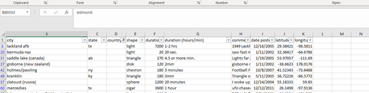
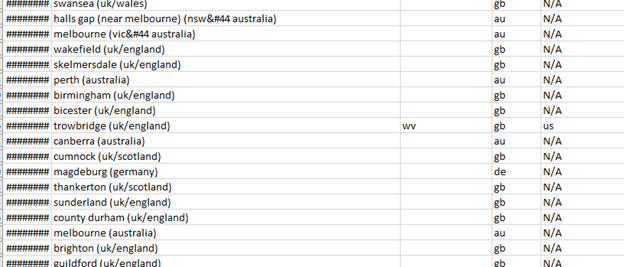

# Introduction

The UFO project is based on the [UFO Sightings dataset](https://www.kaggle.com/datasets/NUFORC/ufo-sightings) uploaded on Kaggle by the National UFO Reporting Center (NUFORC)/ We will be using Microsoft Excel and PostgreSQL for data cleanup. 
We will also be using PostgreSQL and RStudio for manipulating the Data. We will then use Tableau Public for Data Visualization.

# ASK
The questions that will guide our analysis are:
1. How does the number of UFO observations vary by year?
2. How do UFO observations vary by time of day?
3. How can we map the observation data?

# PREPARE
We will first need to download the data. The data is sourced from [here](https://www.kaggle.com/datasets/NUFORC/ufo-sightings)

# PROCESS
To process our data, we will be using Excel and SQL for data cleanup.  We will also use RStudio and Tableau for Visualization
The first step is to clean up the data in Excel. 

## Excel Cleanup
If we first open the CSV file into excel to view the data, we notice that there are some lines that need to be cleaned up. 
There are some lines without a country and without a state attached to them. Since the file contains around 80k lines we can do the cleanup in Microsoft excel.

If we apply a filter in each column, we can see that there are a couple of lines in which states are abbreviated with 2 letters but have no country. 
Looking at the data we see that these abbreviations are used for states/provinces in the US and Canada. Therefore, we conclude that this column is only 
used for sightings in these countries. We can easily add the country to these lines using the SWITCH excel function. We will use the switch function in this case. 
We will create a new column called Country Clean for this.



Below is the code used in Excel referincing the C2 cell:
```excel
=SWITCH(C2,"al","us","ak","us","az","us","ar","us","as","us","ca","us","co","us","ct","us","de","us","dc","us","fl","us","ga","us","gu","us","hi","us","id","us","il","us","in","us","ia","us","ks","us","ky","us","la","us","me","us","md","us","ma","us","mi","us","mn","us","ms","us","mo","us","mt","us","ne","us","nv","us","nh","us","nj","us","nm","us","ny","us","nc","us","nd","us","cm","us","oh","us","ok","us","or","us","pa","us","pr","us","ri","us","sc","us","sd","us","tn","us","tx","us","tt","us","ut","us","vt","us","va","us","vi","us","wa","us","wv","us","wi","us","wy","us","ab","ca","bc","ca","mb","ca","nb","ca","nl","ca","nt","ca","ns","ca","nu","ca","on","ca","pe","ca","qc","ca","sk","ca","yt","ca","N/A")
```
If we select only “au”,”gb”,”de” in the countries we see that there are a couple of entries of states that have a country outside the US and Canada. 
Since the quantity is so small, we manually change those:



## SQL
The next step in our analysis create our table in SQL:

```sql
--First we need to create the UFO_Sightings table in SQL. We do this by executing the following query

CREATE TABLE UFO_Sightings (sighting_id serial,
                           datetime varchar(255),
                           city varchar(255),
                           stateid varchar(255),
                           country varchar(255),
                           country_clean varchar(255),
                           shape varchar(255),
                           duration_seconds float,
                           duration_hrs_min varchar(255),
                           comments varchar(255),
                           date_posted varchar(255),
                           latitude float,
                           longitude float,
                           PRIMARY KEY (sighting_id))
```

The third step is importing the data into our newly created table. We do this using [this instructions](https://www.postgresqltutorial.com/postgresql-tutorial/import-csv-file-into-posgresql-table/).

We now have our data ready for cleanup and analysis

# ANALYZE
With our data imported into SQL we are ready for analysis. Our Analysis will be based on the guide questions in the ASK section of this document.

## SQL
```sql
--We are interested in working with the date the UFO was observed. However on our table the datetime column
--is a string datatype and containts also time data. Fois this data clean up we use the substring as well as
--the to_date functions

SELECT TO_DATE(SUBSTRING(datetime, 0, strpos(datetime,' ')),'MM/DD/YYYY') AS date_observed
FROM ufo_sightings

--We want to look at the years with the most observations. For that we use a modification of the last query

SELECT EXTRACT(YEAR FROM date_observed) AS year_observed, 
COUNT(EXTRACT(YEAR from date_observed)) AS number_of_observations
FROM
(SELECT (TO_DATE(SUBSTRING(datetime, 0, strpos(datetime,' ')),'MM/DD/YYYY')) AS date_observed,*
FROM ufo_sightings) AS ufo_sightings_clean_year

GROUP BY year_observed
ORDER BY number_of_observations DESC

--We are interested in selecting the msot common observation times.  In this case
--We will only be taking the hour portion of each observation

SELECT CAST(NULLIF(SUBSTRING(date_observed,0,strpos(date_observed,':')),'') AS integer) AS hour_observed,
COUNT(*) AS number_of_observations
FROM
(SELECT SUBSTRING(datetime, strpos(datetime,' '),
                  LENGTH(datetime)) AS date_observed, *
                    FROM ufo_sightings) 
                    as ufo_sightings_clean_hr
group by hour_observed
order by number_of_observations desc

--We are also interested in looking at the states with the most observations
--NOTE: The state field is only used for USA and Canada observations. Therefore We will exclude NULL
--values on Stateid

SELECT COUNT(*) AS sate_sighting_count, stateid FROM ufo_sightings
WHERE stateid IS NOT null
GROUP BY stateid
ORDER BY sate_sighting_count DESC

--Lastly we are interested in looking at the countries with the most observations. For that we will use
--the following query

SELECT COUNT(*) AS county_sighting_count, country_clean FROM ufo_sightings 
GROUP BY country_clean
ORDER BY county_sighting_count DESC

--We will then export the results of the data on the queries above to csv files. We will use the COPY function
--Below is an example on the COPY function used on the Sightings by Country
COPY( SELECT COUNT(*) AS county_sighting_count, country_clean FROM ufo_sightings 
GROUP BY country_clean
ORDER BY county_sighting_count DESC) TO 'C:\Users\Public\country_Sighting_info.csv' CSV HEADER
```
## Rstudio
The Analysis on Rstudio can be seen on the [UFO_RMD](ProjectDocuments/UFO_RMD.pdf) file

# SHARE

The following dashboard helps us visualize the UFO sightings data. It has a map of all the locations UFO have been seen. It also has graphs on the hour of observation as well as the year of observation. We can filter the data with the filtering options on the left side of the dashboard:

<div class='tableauPlaceholder' id='viz1663528261317' style='position: relative'><noscript><a href='#'>
  </a></noscript><object class='tableauViz'  style='display:none;'><param name='host_url' value='https%3A%2F%2Fpublic.tableau.com%2F' />
  <param name='embed_code_version' value='3' /> <param name='site_root' value='' /><param name='name' value='DraftUFO_Locations&#47;UFOSightingsDashboard' />
  <param name='tabs' value='no' /><param name='toolbar' value='yes' />
  <param name='static_image' value='https:&#47;&#47;public.tableau.com&#47;static&#47;images&#47;Dr&#47;DraftUFO_Locations&#47;UFOSightingsDashboard&#47;1.png' /> 
  <param name='animate_transition' value='yes' /><param name='display_static_image' value='yes' /><param name='display_spinner' value='yes' />
  <param name='display_overlay' value='yes' /><param name='display_count' value='yes' /><param name='language' value='en-US' /></object></div>                

If you are having trouble with the embeded view above you can Access dashboard [here](https://public.tableau.com/views/DraftUFO_Locations/UFOSightingsDashboard?:language=en-US&:display_count=n&:origin=viz_share_link)

# ACT

Comming soon...

